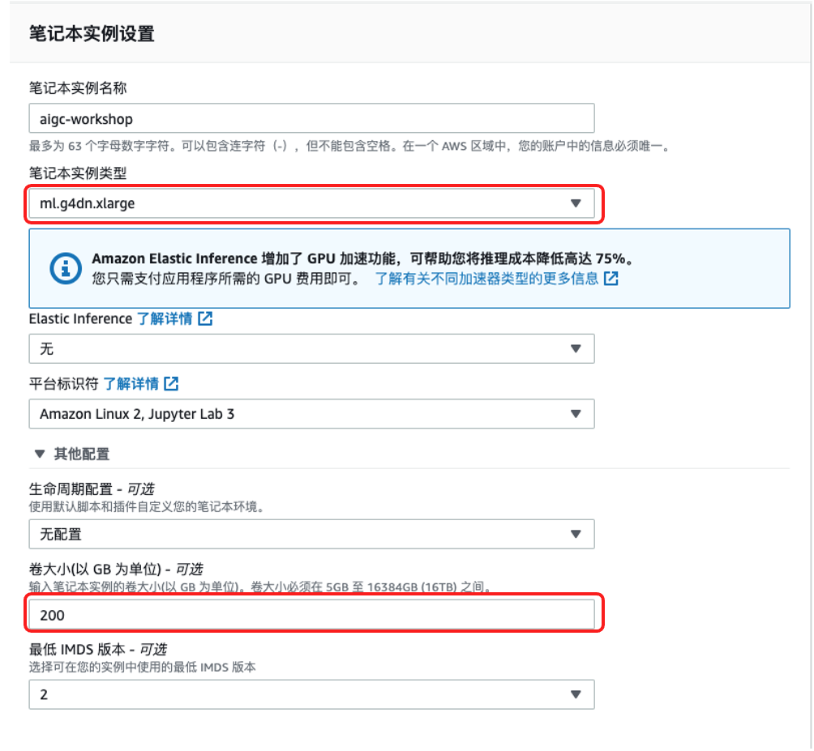
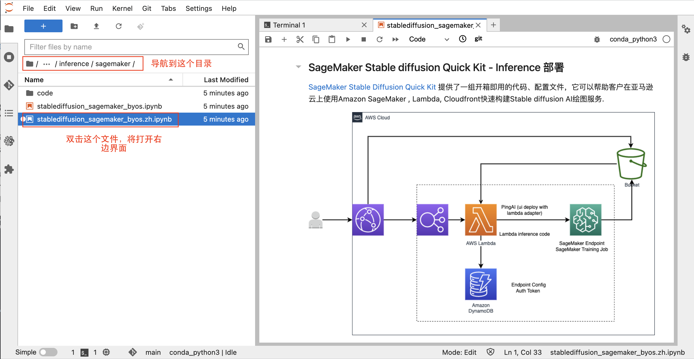
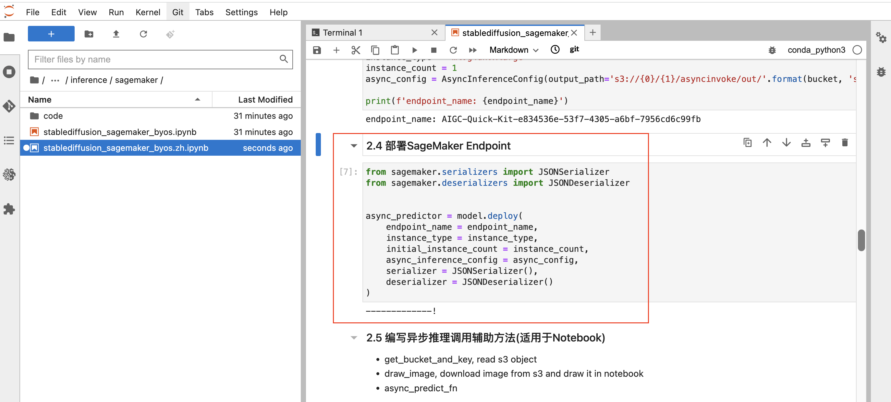
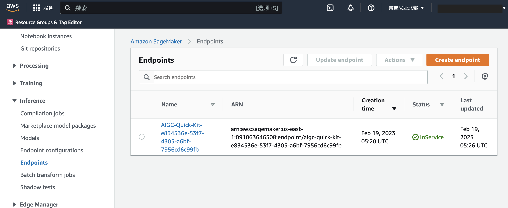
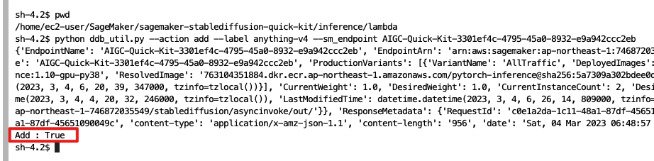

# stable-diffusion-workshop-in-China-region

Note: 此 Guide 为中国区目前部署 stable diffusion quick kit 的部署文档，如需要部署在海外region，请参考[此链接](https://catalog.us-east-1.prod.workshops.aws/workshops/1ac668b1-dbd3-4b45-bf0a-5bc36138fcf1/zh-CN)


## 1. 前提条件
1. 中国区账号
2. 准备一个ICP 备案后的二级或者多级域名，以供中国区 Cloudfront CNAME使用，否则Cloudfront会自动被disable掉, 进一步说明可参考[此链接](https://docs.amazonaws.cn/aws/latest/userguide/cloudfront.html#feature-diff)

## 2. 部署

### 2.1 部署 Stable diffusion 模型
1. 创建 sagemaker jupyter notebook    
   

2. 在jupyter中新建一个terminal，里面输入    
   ````
   cd SageMaker/
   https://github.com/salander0411/stable-diffusion-workshop-in-china-region 
   ````
3. 在sagemaker里 ``cd inference/sagemaker/byos/``，选择 `stablediffusion_sagemaker_byos.zh.ipynb`   
   

4. 启动 notebook 之后根据提示执行 stablediffusion_sagemaker_byos.zh.ipynb 中的代码，直到 2.4 部署 endpoint 为止。（ 执行代码时，需要先点击代码框使代码框获得焦点，然后点击顶部菜单栏的运行按钮即可，执行后会自动打印输出。）   
   
5. 检查 sagemaker 中 endpoint 的生成    
   

### 2.2 部署 SAM 应用

Note: SAM框架会使用 ``sagemaker-<region-code>-xxx`` 的桶，并生成 bucket policy，此policy会覆盖原有的。如果bucket原本就有bucket policy，请先复制出来，之后再append过去

1. 安装部署，请参考[此链接](https://docs.aws.amazon.com/serverless-application-model/latest/developerguide/serverless-getting-started.html)
2. 到 lambda 指定目录下 ,执行 sam 命令    
  ````
  cd inference/lambda
  sam build
  sam deploy --guided
  ````
3. 在交互式会话中，输入cloudfront CNAME（必需步骤），其他均可采用默认值
4. 等待部署完毕。在 Route53 中配置添加 record， 将填入的CNAME 指向 Cloudfront 生成的 xxx.cloudfront.cn 地址

### 2.3 前端部署
1. 准备前端文件并上传至 S3 bucket     
  ````
  cd /home/ec2-user/SageMaker/sagemaker-stablediffusion-quick-kit#获取default region
  default_region=$(aws configure list | grep region | awk '{print $2}')
  default_bucket=$(aws s3 ls | grep sagemaker | grep $default_region | awk '{print $3}')
  aws s3 sync inference/front-ui/build s3://${default_bucket}/aigc/
  ````
2. 配置 sagemaker endpoint。添加SageMaker Endpoint到API_Config, 在jupyter terminal中 将以下命令中的YourSagemakerEndpointName替换成自己环境中的endpoint name     
  ````
  cd inference/lambda
  python ddb_util.py --action add --label anything-v4 --sm_endpoint <YourSagemakerEndpointName>
  ````
   返回如下信息说明添加成功     
   

## 3. 测试
在浏览器中输入 ``{CloudFront_CNAME_URL}/aigc/index.html`` 即可访问 stable diffusion UI

## 4. 改动
如果需要改动前端 JS 和 CSS 文件，请在 front-ui/src 中完成修改。   
最后可运行下面语句，使用 react-scripts  来压缩 JS /css， [source](https://www.npmjs.com/package/compress-create-react-app )
```
npm build run 
```

## 5. 已知限制
1. 同步推理需要等待response，而API Gateway 30s timeout,  因此取决于最大生成image数， Lambda 和 Sagemaker inference instance type 的大小需要做相应调整，否则会引起API接口 timeout无法显示的情况